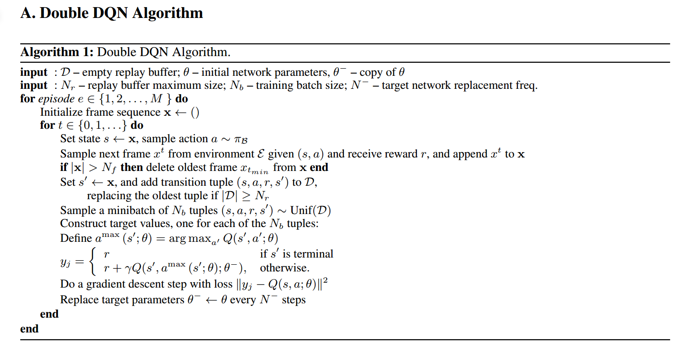
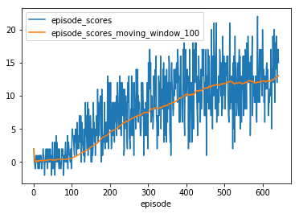
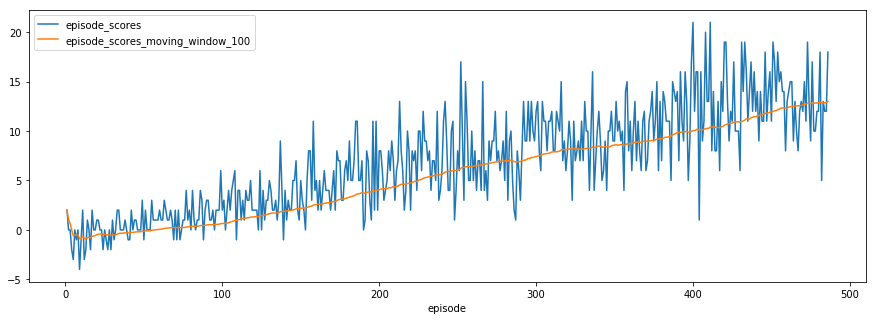

# NAVIGATION PROJECT SOLUTION

### Code Files 

1. Ipython Files

    a. **Navigation DQN.ipynb** => Navigation problem solved using Deep Q Network.

    b. **Navigation DDQN.ipynb** => Navigation problem solved using Double Deep Q Network.

2. Agent Files

    a. **dqn_agent.py** => Deep Q Agent code very similar to **dqn** project in nanodegree

3. Model Files

    a. **model.py** => Deep Q Network code very similar to **dqn** project in nanodegree

4. Model Checkpoint Files

    a. **checkpoint_DQN.pth** => DQN model path

    b. **checkpoint_DDQN.pth** => DDQN model path

### Learning Algorithm

Deep Q Network algorithm is used ... very similar to dqn project in nanodegree. 

Double DQN algorithm explored and implemented as follows.

### Plot of Rewards

#### DQN Scores Plot

Environment solved in 642 episodes

Scores => mean - 8.174, deviation - 5.525

Window Avg Scores => mean - 7.166, deviation - 4.435

#### DDQN Scores Plot

Environment solved in 486 episodes

Scores => mean - 6.872, deviation - 5.244

Window Avg Scores => mean - 5.519, deviation - 4.220

### Ideas for Future Work

1. Using different kind of network (RNN, LSTM, CNN) apart from default network given in dqn project.

2. Using keras in the backend instead of pytorch

3. Try different kind of Deep Q network strategy

4. Still trying out pixel code and not completely ready as it is taking time to run network. Looking at this code for reference and trying out --> https://github.com/gtg162y/DRLND/tree/master/P1_Navigation/visual_pixels

