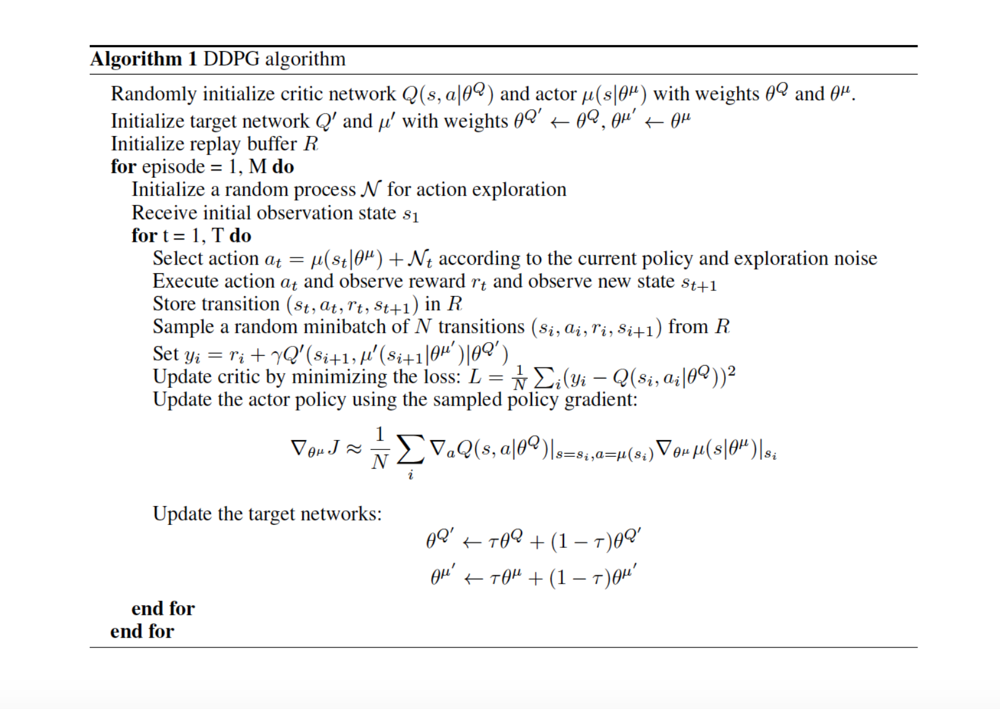
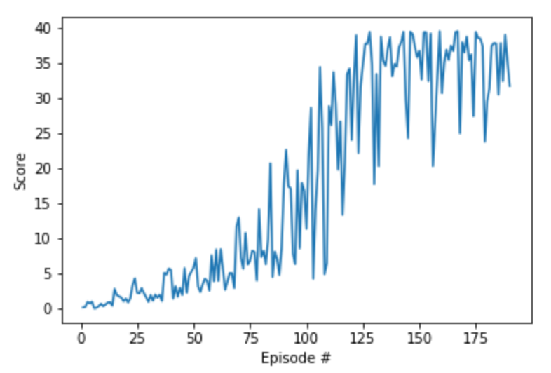

# CONTINUOUS CONTROL - PROJECT OPTION 1 (Single Agent) SOLUTION

### Code Files 

1. Ipython Files

    a. **Continuous_Control - Problem 1 - Single Agent.ipynb** => Project-Option-1 solved with one agnet only (For submission).

    b. **Continuous_Control - Problem 2 - Multiple Agent.ipynb** => Tried to solve project-option-2 with 20 agnets (Testing).

2. Agent Files

    a. **ddpg_agent.py** => Deep Q Agent code very similar to **ddpg** project in nanodegree

3. Model Files

    a. **model.py** => Deep Q Network code very similar to **ddpg** project in nanodegree. 
        But smaller network did not converge, so tried duel/triple layer dense network for both actor and critic.

4. Model Checkpoint Files

    a. **checkpoint_actor_p1.pth** => Project-option-1 actor model file

    b. **checkpoint_critic_p1.pth** => Project-option-1 critic model file

### Learning Algorithm

**Deep Deterministic Policy Gradient (DDPG)**

Although DQN achieved huge success in higher dimensional problem, such as the Atari game, the action space is still discrete. However, many tasks of interest, especially physical control tasks, the action space is continuous. If you discretize the action space too finely, you wind up having an action space that is too large. For instance, assume the degree of free random system is 10. For each of the degree, you divide the space into 4 parts. You wind up having 4¹⁰ =1048576 actions. It is also extremely hard to converge for such a large action space.

DDPG relies on the actor-critic architecture with two eponymous elements, actor and critic. An actor is used to tune the parameter 𝜽 for the policy function, i.e. decide the best action for a specific state.

A critic is used for evaluating the policy function estimated by the actor according to the temporal difference (TD) error.

#### Best Parameters found through experiment 

Tried to use 64, 256 as batch_size but 128 gives better convergence, otherwise all other constants are same as ddpg code.

BUFFER_SIZE = int(1e5)  # replay buffer size
BATCH_SIZE = 128        # minibatch size
GAMMA = 0.99            # discount factor
TAU = 1e-3              # for soft update of target parameters
LR_ACTOR = 2e-4         # learning rate of the actor 
LR_CRITIC = 2e-4        # learning rate of the critic
WEIGHT_DECAY = 0        # L2 weight decay

Neural network of dense layer 1 of 64 units and dense layer 2 of 128 units used. Single layer do not converge somehow. 

### Plot of Rewards

#### DDPG Scores Plot

Environment solved in 90 episodes (as got average score >30 at 190th episode)

Problem-2 with 20 agnets do not stabilize with DDPG over 100 consecutive episodes though it reaches score of 30 in 15 episodes only using agent score averaging.

### Ideas for Future Work

1. Read and use other algorithms for parallelization in 20-agnet project like PPO, A3C, and D4PG 

2. Try to tweak ddpg for 20 agnets ... I was getting >30 score then it was moving between 28-30 for more than 200 iteration. Certainly possible to achieve score of 30.

3. Try optional project crawl with different agents learned above.

